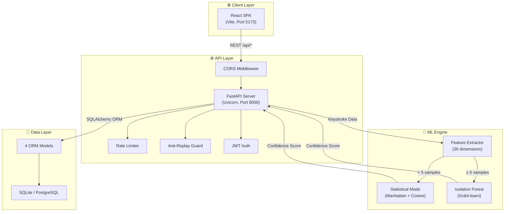
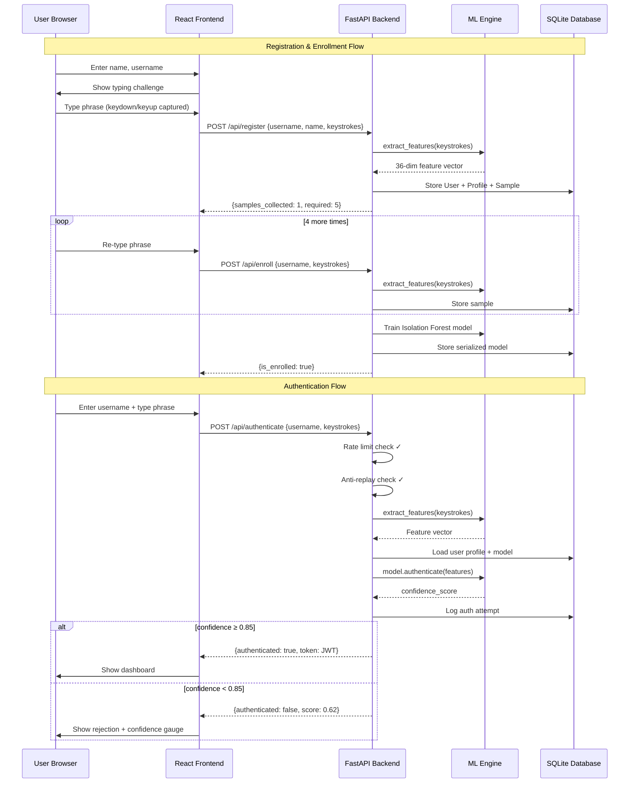
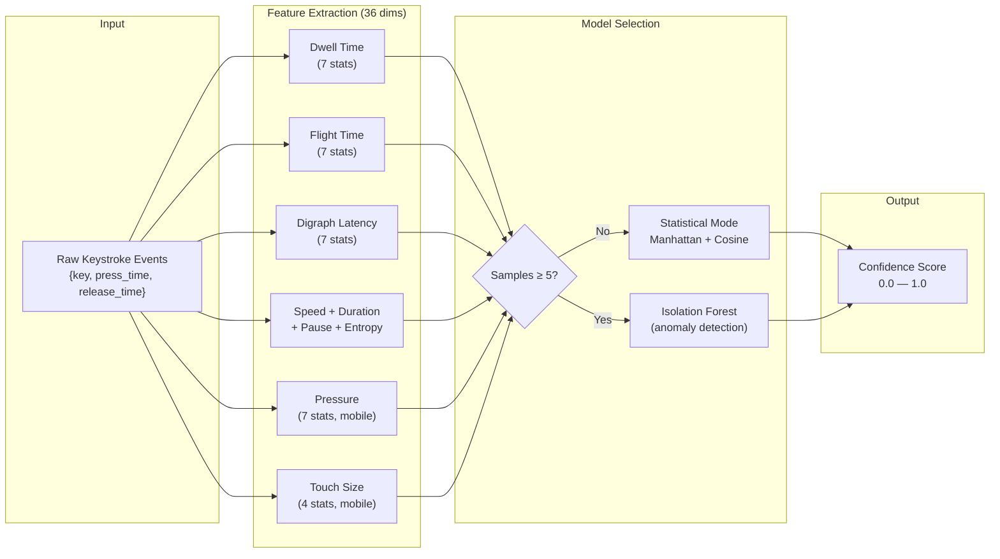
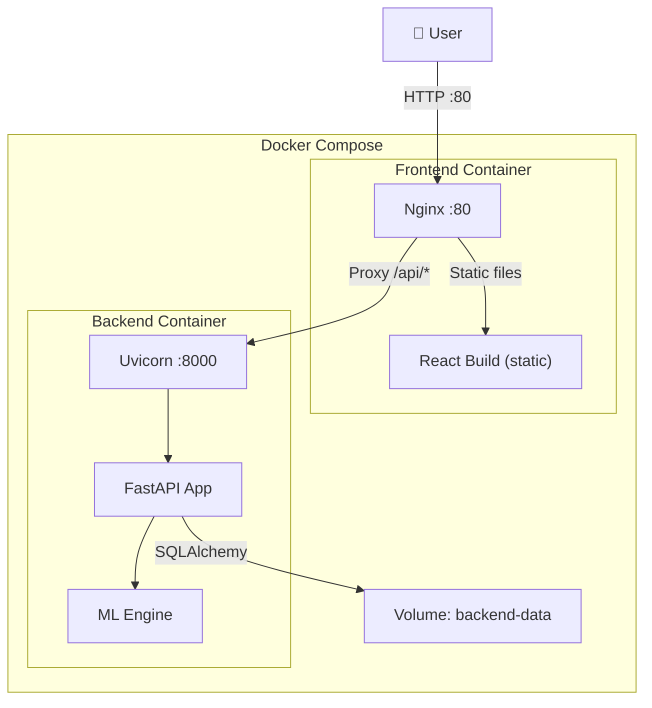

# System Architecture
## KeyAuth — Keystroke Dynamics Authentication

---

## High-Level Architecture



---

## Authentication Flow



---

## ML Pipeline Detail



---

## Deployment Architecture



---

## Security Architecture

| Layer | Protection | Implementation |
|-------|-----------|---------------|
| Transport | API proxy | Nginx reverse proxy strips direct backend access |
| Request | Rate limiting | 5 attempts / username / 60 seconds |
| Request | Anti-replay | Hash-based duplicate detection (10 min window) |
| Auth | JWT tokens | HS256, configurable expiry (default 60 min) |
| Data | No passwords | Behavioral biometrics only — nothing to steal |
| CORS | Origin whitelist | Configurable allowed origins |

---

## Directory Structure

```
Keystroke Dynamics Authentication/
├── backend/
│   ├── app/
│   │   ├── __init__.py
│   │   ├── main.py              # FastAPI app entry
│   │   ├── config.py            # Settings (env vars)
│   │   ├── database.py          # SQLAlchemy setup
│   │   ├── models.py            # 4 ORM models
│   │   ├── schemas.py           # Pydantic validation
│   │   ├── auth.py              # JWT utilities
│   │   ├── security.py          # Anti-replay + rate limiter
│   │   ├── ml/
│   │   │   ├── __init__.py
│   │   │   ├── feature_extractor.py  # 36-feature extraction
│   │   │   ├── model.py              # ML engine
│   │   │   └── utils.py              # Math helpers
│   │   └── routes/
│   │       ├── __init__.py
│   │       ├── registration.py   # Register + Enroll
│   │       ├── authentication.py # Authenticate
│   │       └── user.py           # Profile + History
│   ├── Dockerfile
│   ├── requirements.txt
│   ├── .env.example
│   └── .dockerignore
├── web-frontend/
│   ├── src/
│   │   ├── api/client.js         # API client
│   │   ├── hooks/useKeystrokeCapture.js
│   │   ├── components/
│   │   │   ├── Navbar.jsx
│   │   │   ├── ConfidenceGauge.jsx
│   │   │   └── TypingMetrics.jsx
│   │   ├── pages/
│   │   │   ├── RegisterPage.jsx
│   │   │   ├── LoginPage.jsx
│   │   │   └── DashboardPage.jsx
│   │   ├── styles/index.css
│   │   ├── App.jsx
│   │   └── main.jsx
│   ├── Dockerfile
│   ├── package.json
│   └── vite.config.js
├── docs/
│   ├── SRS.md
│   ├── ER_Diagram.md
│   └── Architecture.md
├── docker-compose.yml
└── README.md
```
