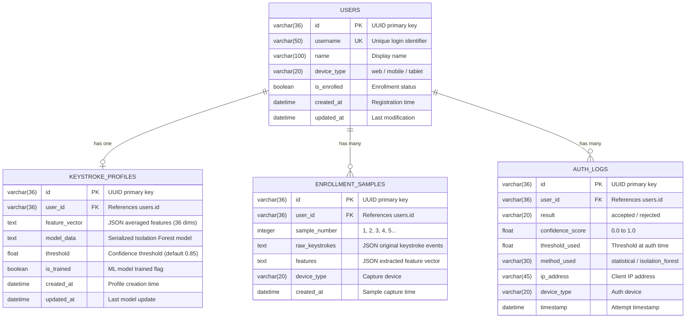

# ER Diagram — KeyAuth Database
## Keystroke Dynamics Authentication System

This document contains the Entity-Relationship diagram for the KeyAuth database.

---

## ER Diagram (Mermaid)

---

## Relationships

| Relationship | Cardinality | Description |
|-------------|-------------|-------------|
| Users → Keystroke Profiles | 1 : 0..1 | Each user has at most one keystroke profile |
| Users → Enrollment Samples | 1 : 0..N | Each user can have multiple enrollment samples |
| Users → Auth Logs | 1 : 0..N | Each user can have multiple authentication attempts |

---

## Feature Vector Structure (36 Dimensions)

| Index | Feature | Category |
|-------|---------|----------|
| 0-6 | Dwell time (mean, std, min, max, median, Q25, Q75) | Key hold duration |
| 7-13 | Flight time (mean, std, min, max, median, Q25, Q75) | Inter-key interval |
| 14-20 | Digraph latency (mean, std, min, max, median, Q25, Q75) | Key-pair timing |
| 21 | Typing speed (chars/sec) | Overall speed |
| 22 | Total typing duration (ms) | Session length |
| 23 | Pause ratio | Pauses / total time |
| 24 | Key transition entropy | Timing consistency |
| 25-31 | Pressure stats (mean, std, min, max, median, Q25, Q75) | Touch pressure (mobile) |
| 32-35 | Touch size stats (mean, std, Q25, Q75) | Touch area (mobile) |
